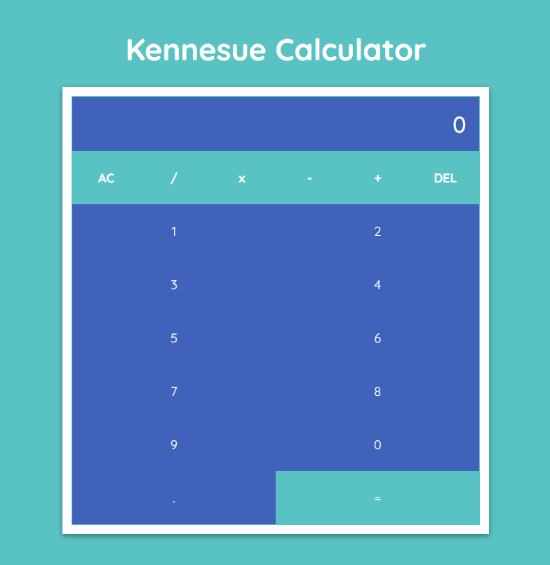

# Calculator

## What I learn

I conducted a two-hour study on the UI layout and functionality required for the calculator app, then I utilized my minimal knowledge of react to apply my research, using the useState Hook to control the dom.